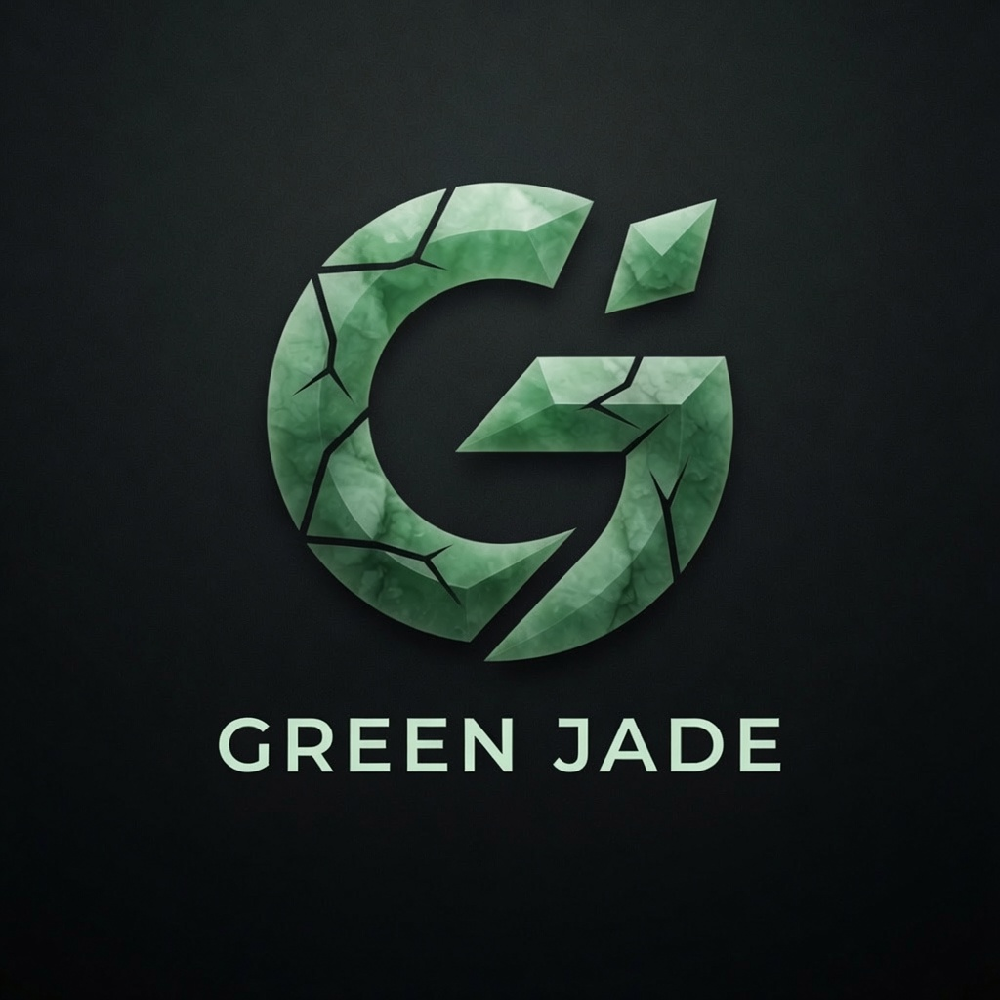

<p align="center">
  
</p>

# GreenJade

**A pure-C microkernel desktop OS** — dual-licensed **MIT OR Apache-2.0**, no GPL in the tree.

GreenJade is a from-scratch, capability-based kernel and userspace personality aimed at a **general-purpose desktop / workstation**. Small trusted core, doors and caps for isolation, and a clean-room Linux ABI path so desktop software (and eventually Steam via Proton) can run without pasting copyleft kernel code.

If you just cloned the repo: a normal host toolchain and QEMU are enough to build and smoke.

---

## At a glance

| | |
|--|--|
| **What it is** | Freestanding pure-C microkernel + hybrid Linux personality |
| **What it is not** | A Linux distro, SteamOS port, or GPL-derived kernel |
| **Priorities** | **1. Security → 2. Performance → 3. Portability → 4. Readability** |
| **License** | **MIT OR Apache-2.0** (dual) — **no GPL/copyleft source** |
| **Language** | Pure C only in-tree (no C++, Rust, …) |
| **Firmware** | **UEFI** product path; Multiboot2 bring-up for QEMU |
| **Adoption bar** | **Steam Deck Top 50** via Proton on real hardware — **target**, not claimed done |
| **Hardware bar** | **≥ 1 TiB RAM**, SMP, SAS/SCSI (product goals; bring-up runs on modest QEMU) |
| **Style** | Hungarian notation — [STYLE.md](STYLE.md) |

---

**Host tools you need:**

- `gcc` or `clang`, `ld` (binutils), `make`
- For QEMU run: `qemu-system-x86_64` / `qemu-kvm`
- Optional: `grub2-mkrescue` (live ISO), OVMF (UEFI smoke), `aarch64-linux-gnu-gcc` (optional aarch64 scaffold)

Clone → build → run. Artifacts land under `build/` (local only).

```sh
git clone git@github.com:theolddogcometh/GreenJade.git
cd GreenJade
make            # → build/greenjade.elf
make run        # QEMU, serial on stdio
# or: make smoke
```

---

## Quick start (M0 — Multiboot2 + QEMU)

```sh
make            # → build/greenjade.elf
make userland   # init, shell, ld-gj, libcgj, servers
make run        # QEMU q35 + virtio, serial on stdio
GJ_SMP=4 make run
make smoke      # Multiboot + OVMF + packaging + license gate
make clean
```

### More targets (when you want them)

```sh
make libcgj         # clean-room glibc-shaped libc
make uefi-stub      # freestanding UEFI handoff object
make greenjade.efi  # → build/GreenJade.efi
make ovmf           # QEMU + OVMF GPT ESP boot
make stage-esp      # ESP layout for real-hw copy
make stage-rootfs   # rootfs layout
make install-img    # GPT install image (local build only)
make live-iso       # hybrid Multiboot2+EFI test ISO (local build only)
make hwtest-img     # dual-partition hardware-test image
make sshd-gj        # freestanding product sshd
make udx            # host UDX driver runtime
make license        # coarse GPL guard
```

USB / lab helpers (`install-usb`, `steam-fetch`, …) need root or lab host setup — see [docs/STEAM_HWTEST.md](docs/STEAM_HWTEST.md) and [docs/HCL.md](docs/HCL.md).

**Bring-up today (QEMU / soft product markers):** Multiboot2 + OVMF UEFI, SMP, virtio, hybrid Linux ABI surface, PE32 Wine int80 path, ELF dynlinker, fork COW, doors/session/ICD, packaging. Kernel smoke aims for **M0 OK** / **UD=0**. Media may stage a Steam tree as **READY**; that is bootstrap only.

**Bar3 honesty:** Bar3 means a real-DUT path where the Steam **client** launches and Deck Top 50 titles can leave `NOT-TRIED`. Host/media staging, kernel smokes, and continuum soft gates are **not** bar3 completion. Client launch, title runs, and matrix fill are **open** — see [docs/STEAM_BAR3_STATUS.md](docs/STEAM_BAR3_STATUS.md).

**Soft continuum high-water:** CREATE-ONLY libcgj graph parent wire **advancing toward 20400** soft only (honest `makefile_max` is a Makefile scan — verify with `./scripts/gj-continuum-makefile-snippet.sh --max`; may still report **20300** until parent wires (scan is source of truth; greppable **20400** when wired)). Wave 62 soft deepen surfaces **retbastionface**/**retcurtainangle** (CREATE-ONLY soft only). Product lamps remain **0**. Soft continuum **≠ bar3** and **≠ product complete**.

**Still open:** real-hardware UEFI install + Steam client, Deck Top 50 (matrix remains **NOT-TRIED**), full multi-server confine product, full ≥ 1 TiB soak when host allows.

---

## Docs

| Doc | Purpose |
|-----|---------|
| [Architecture](docs/GREENJADE_KERNEL_SPEC.md) | Project law, product bars, milestones |
| [**Design complete freeze**](docs/DESIGN_SPEC_COMPLETE.md) | Isolation, doors, AC, matrix, locks, clean-room |
| [Security core](docs/SECURITY_CORE_DESIGN.md) | Caps, revoke, IPC, SMP, quotas |
| [Cap addressing](docs/CAP_ADDRESSING.md) | Scheme A; root meta; pager |
| [Proton personality](docs/PROTON_PERSONALITY.md) | Deck Top 50; clean-room Linux ABI |
| [Steam bar3 status](docs/STEAM_BAR3_STATUS.md) | Honest product ceiling (READY ≠ titles) |
| [glibc compat](docs/GLIBC_COMPAT.md) | Clean-room **libcgj** → `libc.so.6` |
| [Linux ABI hybrid](docs/LINUX_ABI_HYBRID.md) | Option C hot/cold SYSCALL |
| [Apple channel](docs/APPLE_CHANNEL_REMAINING.md) | VM objects, task ports, QoS, session |
| [Solaris remaining](docs/SOLARIS_STYLE_REMAINING.md) | Untyped, CDT, map cookie |
| [x86_64 Intel platform](docs/X86_64_INTEL_PLATFORM.md) | UEFI, VT-d, x2APIC, TSC |
| [HCL](docs/HCL.md) | Hardware tiers T0–T3 + install checklist |
| [UDX Linux porter](docs/UDX_LINUX_PORTER.md) | Userspace driver API |
| [Implementation](docs/IMPLEMENTATION.md) / [TODO](docs/TODO.md) | Coding phases |
| [Deck Top 50 matrix](matrix/deck-top50-TEMPLATE.md) | Adoption tracking |
| [STYLE](STYLE.md) · [LICENSE](LICENSE) | Style · dual MIT/Apache |

Driver hosts use **UDX** (`user/udx/`) — Linux-shaped `probe` / `irq` / `dma` / `mmio` with caps hidden; see the UDX guide.

---

## Start coding

1. [docs/TODO.md](docs/TODO.md) — backlog and phases  
2. [docs/IMPLEMENTATION.md](docs/IMPLEMENTATION.md) — how pieces fit  
3. [STYLE.md](STYLE.md) — Hungarian + dual-license SPDX  

---

## Heritage

Structural inspiration from the classic Pink/Taligent **Opus** microkernel idea (tiny core, services outside). Product name: **GreenJade**.
