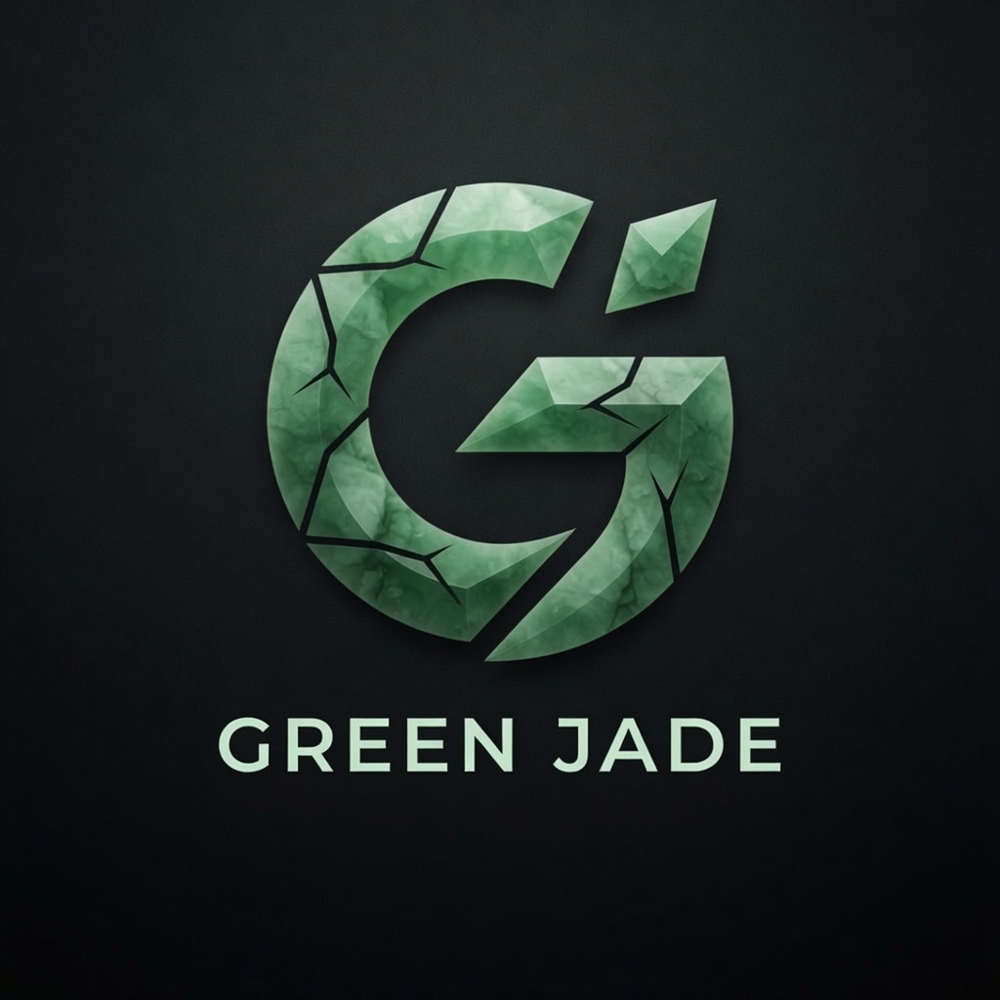

<p align="center">
  
</p>

# GreenJade

**A pure-C microkernel desktop OS** — dual-licensed **MIT OR Apache-2.0**, no GPL in the **product core**.

GreenJade is a from-scratch OS kernel and userspace personality aimed at a **general-purpose desktop / workstation**. The kernel stays small on purpose: programs only get the access they are given, talk through the OS on purpose, and drivers live in **userspace** over a Linux-shaped ABI (so a flaky NIC driver need not take down the whole machine). Clean-room path toward desktop software and eventually **Steam via Proton** — without pasting a GPL kernel into the product core.

If you just cloned the repo: a normal host toolchain and QEMU are enough to build and smoke. Optional support: **[Patreon — TheOldDog](https://www.patreon.com/cw/TheOldDog)**.

---

## At a glance

| | |
|--|--|
| **What it is** | Freestanding pure-C microkernel + hybrid Linux personality |
| **What it is not** | A Linux distro, SteamOS port, or GPL-derived kernel |
| **Priorities** | **1. Security → 2. Performance → 3. Portability → 4. Readability** |
| **License** | Product: **MIT OR Apache-2.0**. Vendor (OpenSSH, OpenSSL, dash, …) lives only under [`third_party/<license>/`](third_party/PROVENANCE.md). **No GPL** in the product core. The license controls the software (grant, warranty disclaimer, limitation of liability). |
| **Legal notice** | (A) **You** bear compliance where you build, run, or ship. (B) The principal author reserves constitutional rights the license does not waive. Full text: [docs/LEGAL_DISCLAIMER.md](docs/LEGAL_DISCLAIMER.md) |
| **Language** | Pure C only in-tree (no C++, Rust, …) |
| **Firmware** | **UEFI** product path; Multiboot2 bring-up for QEMU |
| **Adoption bar** | **Steam Deck Top 50** via Proton on real hardware — **target**, not claimed done |
| **Hardware bar** | **≥ 1 TiB RAM**, SMP, SAS/SCSI (product goals; bring-up runs on modest QEMU) |
| **Style** | Hungarian notation — [STYLE.md](STYLE.md) |
| **Assurance** | [docs/ASSURANCE_LITE.md](docs/ASSURANCE_LITE.md) — Soft≠product · G-AC-1 · Dual DoD **L3** = host probes on stamped image. `make assurance-check` is **L1 only** (not Dual DoD close). |
| **Support** | [Patreon — TheOldDog](https://www.patreon.com/cw/TheOldDog) — optional funding for hardware digs and late-night boots |

---

**Host tools you need:**

- `gcc` or `clang`, `ld` (binutils), `make`
- For QEMU run: `qemu-system-x86_64` / `qemu-kvm`
- Optional: `grub2-mkrescue` (live ISO), OVMF (UEFI smoke), `aarch64-linux-gnu-gcc` (optional aarch64 scaffold)

Clone → build → run. Artifacts land under `build/` (local only).

```sh
git clone git@github.com:theolddogcometh/GreenJade.git
cd GreenJade
make            # → build/greenjade.elf
make run        # QEMU, serial on stdio
# or: make smoke
```

---

## Quick start (M0 — Multiboot2 + QEMU)

```sh
make            # → build/greenjade.elf
make userland   # init, shell, ld-gj, libcgj, servers
make run        # QEMU q35 + virtio, serial on stdio
GJ_SMP=4 make run
make smoke      # Multiboot + OVMF + packaging + license gate
make clean
```

### More targets (when you want them)

```sh
make libcgj         # clean-room glibc-shaped libc
make uefi-stub      # freestanding UEFI handoff object
make greenjade.efi  # → build/GreenJade.efi
make ovmf           # QEMU + OVMF GPT ESP boot
make stage-esp      # ESP layout for real-hw copy
make stage-rootfs   # rootfs layout
make install-img    # GPT install image (local build only)
make live-iso       # hybrid Multiboot2+EFI test ISO (local build only)
make hwtest-img     # dual-partition hardware-test image
make openssh-host   # host OpenSSH 10.5p1 (not DUT)
make openssh-dut    # DUT OpenSSH trio (Linux ABI; not Dual DoD B close)
make udx            # host UDX driver runtime
make license        # product SPDX + vendor folder + provenance gate
```

USB / lab helpers (`install-usb`, `steam-fetch`, …) need root or lab host setup — see [docs/STEAM_HWTEST.md](docs/STEAM_HWTEST.md) and [docs/HCL.md](docs/HCL.md).

**Bring-up today (QEMU / soft product markers):** Multiboot2 + OVMF UEFI, SMP, virtio, hybrid Linux ABI surface, PE32 Wine int80 path, ELF dynlinker, fork COW, doors/session/ICD, packaging. Kernel smoke aims for **M0 OK** / **UD=0**. Media may stage a Steam tree as **READY**; that is bootstrap only.

**Bar3 / Deck Top 50:** status and definitions live in **one place only** — [docs/STEAM_BAR3_STATUS.md](docs/STEAM_BAR3_STATUS.md) (currently **OPEN** / **NOT-TRIED × 50**). Boot console and soft inventory lamps do **not** restate bar3.

**Soft continuum high-water:** CREATE-ONLY libcgj graph parent wire (verify with `./scripts/gj-continuum-makefile-snippet.sh --max`). Product lamps remain **0**. Soft continuum is not product complete and is not Deck Top 50 progress.

**Still open:** real-hardware UEFI install + Steam client, Deck Top 50 (matrix remains **NOT-TRIED**), full multi-server confine product, full ≥ 1 TiB soak when host allows.

---

## ABI-first + laptop Linux drivers (G752VT)

Product direction is **ABI-first** (Linux-shaped **userspace** drivers over hot+cold ABI + **DDI/UDX**). In-kernel freestanding class drivers are **SKIP by default** — not Dual DoD close.

| Layer | Role | Claim |
|-------|------|--------|
| **Linux-shaped userspace** | Option C ABI, libcgj, servers | Product path for apps |
| **DDI / UDX hosts** | `rtl8168_udx` · `xhci_udx` · `ddi_host_gj` | Dual DoD **B** (NIC) / **A** (USB) product direction |
| **Soft module path** | Host-collected `.ko` via ksym (eng) | **Soft ≠ product**; **G-AC-1** no `.ko` product AC |
| **Freestanding class** | `rtl8168` / `xhci_msc` | **SKIP** default (`GJ_RTL8168_PROBE=0` · `GJ_XHCI_MSC_PROBE=0`) |
| **T0 product net (QEMU)** | **virtio-net** | QEMU/CI. Laptop wire is **UDX** (`rtl8168_udx`) |
| **Fly bar** | `GJ_IMAGE_VERSION` | Semver fly stamp — **STATUS (static) v0.1.184**; Dual DoD **A** park RS-off · **B** exec TX drain after 183 Sending command (login OPEN); **0.2.0** reserved |

**First DUT:** ASUS ROG **G752VT** — NIC `10ec:8168`, xHCI `8086:a12f`, lab static **10.200.125.50**.

### Dual DoD (honest)

| # | Goal | Path | Status |
|---|------|------|--------|
| **A** | Linux-shaped USB | `xhci_udx` + DDI | **OPEN** — RS-off park (177 host `PASS rs=0`); never `USBCMD.RS=1`; USB path OPEN |
| **B** | Linux-shaped NIC + stack + sshd | `rtl8168_udx` → kernel `net_tcp` → **OpenSSH 10.5** (Linux ABI) | **OPEN** until host **interactive login**. Historical SUCCESS on **0.1.178** was abandoned `sshd_gj`. **0.1.183** host: `Sending command: true` **PASS**; exec 124. Fly **0.1.184** packed, not host-probed. GOP isolate. Soft lamps ≠ close |

**Lab status (honest):** Fly **v0.1.184** packed, not host-probed (Dual DoD **A** park RS-off · **B** exec TX drain after 183 Sending command; GOP isolate; login OPEN). Dual DoD A **OPEN** until host USB path · Dual DoD B **OPEN** until interactive SSH login. Soft ≠ product; **G-AC-1**. Backlog: [docs/TODO.md](docs/TODO.md) · [docs/ASSURANCE_LITE.md](docs/ASSURANCE_LITE.md).

```sh
make collect-linux-drivers   # host .ko → build/linux-drivers/ (+ NEEDED-DRIVERS)
make hwtest-img              # → build/greenjade-hwtest.img (ESP + GJ-PERSIST)
sudo ./scripts/install-hwtest-usb.sh /dev/sdX
# after boot (lab): panel STATUS (static) v… ; arping / ping 10.200.125.50 ; nc -v -w 3 10.200.125.50 22
```

On boot, GOP **left pane** is split: top **STATUS (static)** holds, bottom **STATE (boot)** (high-level phases). Right pane is the fast **LOG**. Holds are live product only:

| Hold | Example |
|------|---------|
| title | `STATUS (static) v0.1.184` |
| 1 | `M0 OK dash SKIP isolate` |
| 2 | `TE mode=… tes= tt=ML slpt=` |
| 3 | `UDX xhci PASS rs=0 … ccs=1` (Dual DoD A **OPEN**; RS-off ≠ USB path) |
| 4 | `UDX inj= tx= lnk=` |
| 5 | `UDX te_disarm wire own= rok= fovw=` |
| 6 | `UDX mac_rclm …` |
| 7 | `IP 10.200.125.50 :22` |
| 8 | `DoD A=OPEN B=OPEN` |

Abandoned in-kernel rtl/xhci_msc/linux_*_soft live in `./abandoned` (not linked).

---

## Docs

| Doc | Purpose |
|-----|---------|
| [Architecture](docs/GREENJADE_KERNEL_SPEC.md) | Project law, product bars, milestones |
| [**Design complete freeze**](docs/DESIGN_SPEC_COMPLETE.md) | Isolation, doors, AC, matrix, locks, clean-room |
| [**ABI-first pivot**](docs/ABI_FIRST_PIVOT.md) | Strategy: ABI + DDI + host drivers over freestanding thrash |
| [ABI wave status](docs/ABI_WAVE_STATUS.md) | Soft wave lamps / module path status |
| [Linux module path](docs/LINUX_MODULE_PATH.md) | Soft `.ko` loader, ksym, r8169 embed, xHCI builtin |
| [Laptop Linux driver host](docs/LAPTOP_LINUX_DRIVER_HOST.md) | G752VT collect / stage / STATUS expectations |
| [DDI soft](docs/DDI_SOFT.md) | Soft DDI door / devmgr inventory |
| [PCI soft layout](docs/PCI_DEV_SOFT_LAYOUT.md) | Soft vs host `pci_dev` for real probe |
| [G752VT Linux hwtest](docs/G752VT_LINUX_HWTEST.md) | DUT map + freestanding vs Linux inventory |
| [Security core](docs/SECURITY_CORE_DESIGN.md) | Caps, revoke, IPC, SMP, quotas |
| [Cap addressing](docs/CAP_ADDRESSING.md) | Scheme A; root meta; pager |
| [Proton personality](docs/PROTON_PERSONALITY.md) | Deck Top 50; clean-room Linux ABI |
| [Steam bar3 status](docs/STEAM_BAR3_STATUS.md) | Honest product ceiling (READY ≠ titles) |
| [glibc compat](docs/GLIBC_COMPAT.md) | Clean-room **libcgj** → `libc.so.6` |
| [Linux ABI hybrid](docs/LINUX_ABI_HYBRID.md) | Option C hot/cold SYSCALL |
| [Apple channel](docs/APPLE_CHANNEL_REMAINING.md) | VM objects, task ports, QoS, session |
| [Solaris remaining](docs/SOLARIS_STYLE_REMAINING.md) | Untyped, CDT, map cookie |
| [x86_64 Intel platform](docs/X86_64_INTEL_PLATFORM.md) | UEFI, VT-d, x2APIC, TSC |
| [HCL](docs/HCL.md) | Hardware tiers T0–T3 + install checklist |
| [HW test tomorrow](docs/HWTEST_TOMORROW.md) | Operator checklist for DUT media |
| [UDX Linux porter](docs/UDX_LINUX_PORTER.md) | Userspace driver API |
| [Implementation](docs/IMPLEMENTATION.md) / [TODO](docs/TODO.md) | Coding phases |
| [Deck Top 50 matrix](matrix/deck-top50-TEMPLATE.md) | Adoption tracking |
| [STYLE](STYLE.md) · [LICENSE](LICENSE) | Style · dual MIT/Apache (product) |
| [**Third-party provenance**](third_party/PROVENANCE.md) | Vendor licenses, hashes, omitted GPL, what is linked |
| [**Legal notice**](docs/LEGAL_DISCLAIMER.md) | License controls the software · user/operator compliance · author reserves constitutional rights |

Driver hosts use **UDX** (`user/udx/`) and soft DDI (`user/drivers/`) — Linux-shaped `probe` / `irq` / `dma` / `mmio` with caps hidden; see the UDX guide.

---

## Legal notice

**The license controls the software.** Copyright and patent grants, the warranty disclaimer, and the limitation of liability are in **[LICENSE](LICENSE)** (MIT OR Apache-2.0, at the licensee’s option). The legal notice adds only: **(A)** users and operators bear their own compliance; **(B)** the principal author reserves constitutional rights the license does not waive. Full text: **[docs/LEGAL_DISCLAIMER.md](docs/LEGAL_DISCLAIMER.md)**. **Not legal advice.**

**(A) Users, redistributors, and operators.** A person who obtains, builds, runs, modifies, ships, or offers GreenJade is responsible for whether that conduct is lawful where that person acts. Do not use the Software where it is illegal or requires an authorization you do not have. If you productize a copy (appliance, image, OEM firmware, application marketplace, or service), age/identity, KYC, parental-consent, app-store, and operating-system signal statutes that apply to *your* facts are *your* duties — including California A.B. 1043, Illinois P.A. 104-0664, Colorado S.B. 26-051, Texas S.B. 2420, and counterparts. Publication of this source is not performance of those duties for a third party’s deployment. This tree does not ship an identity or age-gate system.

**(B) Principal author’s reserved rights.** The principal copyright holder is a U.S. citizen. Dual open-source licensing is a private copyright license, not consent to an unconstitutional search or seizure, not a waiver of the First, Fourth, or Fifth Amendments, and not a government contract. Source, documentation, and project writings are speech. Licensing this repository does not invite officers into the author’s devices, keys, accounts, or working copy. Forcing the author to write, ship, and maintain a state-prescribed age-collection interface or age-bracket signal is compelled speech; the author objects to any construction of those statutes that treats publication of this source as an order to build that apparatus.

**Claimed damages (author vs government, not licensees).** If the author sues for a color-of-law violation tied to this project or its speech, the author will ask the trier of fact for: **4×** a fine, fee, bond, assessment, or other money demand; **USD $1,000,000 per hour** (or fraction) of detention or imprisonment; **USD $1,000,000 per act** of unconstitutional search, seizure, or compelled production of the author, papers, devices, data, code, keys, or accounts. Those figures are the author’s publicly stated demand. They are not a court award, lien, or debt. They do not apply to private licensees who use the software in good faith under MIT or Apache-2.0.

---

## Start coding

1. [docs/TODO.md](docs/TODO.md) — backlog and phases  
2. [docs/IMPLEMENTATION.md](docs/IMPLEMENTATION.md) — how pieces fit  
3. [STYLE.md](STYLE.md) — Hungarian + dual-license SPDX  

---

## Heritage

Structural inspiration from the classic Pink/Taligent **Opus** microkernel idea (tiny core, services outside). Product name: **GreenJade**.
